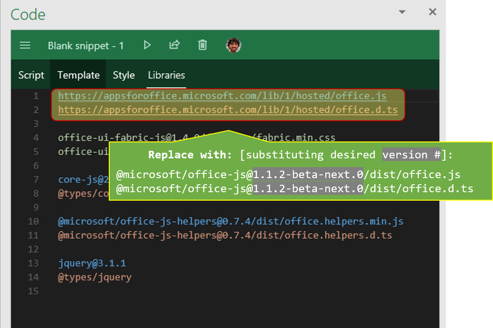

# Office JavaScript APIs

The JavaScript API for Office enables you to create web applications that interact with the object models in Office host applications. Your application will reference the office.js library, which is a script loader. The office.js library loads the object models that are applicable to the Office application that is running the add-in.

 

## About the NPM package

The NPM package for Office.js is a copy of what gets published to the official "evergreen" Office.js CDN, at **<https://appsforoffice.microsoft.com/lib/1/hosted/office.js>**. 

While the Office.js CDN contains all currently available Office.js APIs at any moment in time, each version of the NPM package for Office.js contains only the Office.js APIs that were available at the point in time when that version of the NPM package was created. 

### Target scenarios

The NPM package for Office.js is intended as a way for you to obtain your own (non-CDN) copy of the Office.js files, which you can then statically serve from your own site instead of using the CDN. This NPM package is primarily provided to address the following scenarios:

1. If you are developing an add-in behind a firewall, where accessing the Office.js CDN is not possible.

2. If you need offline access to the Office.js APIs (for example, to facilitate offline debugging).

Additionally, using the alpha and beta versions of the NPM package can facilitate faster-cadence beta-testing (relative to the slower-cadence beta CDN at **<https://appsforoffice.microsoft.com/lib/beta/hosted/office.js>**).

### Best practices

Best practices for using the Office.js NPM package include:

- Refresh your NPM package periodically (to gain access to new APIs and/or bug fixes that may not have been available in your current version of the package).

- Use the NPM package according to the instructions in [Using the NPM package](#using-the-npm-package); do not try to import the NPM package as you might commonly do with other NPM packages.

- Do not use the NPM package in an add-in that you submit for publication to [AppSource](https://appsource.microsoft.com/marketplace/apps?product=office). Add-ins that are published to AppSource must use the Office.js CDN.

 

## Installing the NPM package

To install `@microsoft/office-js` locally via the NPM package, run the following command:

    npm install @microsoft/office-js --save

 

## Using the NPM package

Installing the NPM package locally creates a set of static Office.js files in the `node_modules\@microsoft\office-js\dist` folder of the directory where you ran the `npm install` command. To use the NPM package, do the following:

1. Copy the contents of this folder as-is to the destination of your choosing.

2. Reference that location in a ``

 

## IntelliSense definitions

TypeScript definitions for Office.js are available.

* For **latest RELEASE version** of Office.js:
 * DefinitelyTyped: <https://github.com/DefinitelyTyped/DefinitelyTyped/blob/master/types/office-js/index.d.ts>
 * @types: `@types/office-js`.  (Acquire as `npm install @types/office-js --save-dev`)
* For **any version** (**including RELEASE**, but also including ALPHA, BETA, etc.):
  * Inside of the NPM package, under `dist/office.d.ts`
  * In this repo: [dist/office.d.ts](dis/office.d.ts)

Visual Studio 2017+ can use these same TypeScript definitions, even for regular JavaScript.  For JavaScript IntelliSense in earlier versions of Visual Studio, an `office-vsdoc.js` is available alongside the `office.js` file.  As long as you have a `Scripts/_references.js` file in your VS project, and as long as you substitute the existing triple-slash reference (`/// <reference path="https://.../office.js" />`) with the new location (the `-vsdoc` part gets substituted automatically, so use it just as you would in a `

You can see the different versions of the NPM package listed in the dropdown on the top right at <https://unpkg.com/@microsoft/office-js/>.  This provides the alpha and beta versions as well.

To view the latest version numbers for each of the tags, you can also run the following command on the command-line:

    npm view @microsoft/office-js dist-tags --json

When you have a version number, can use it as follows with <https://unpkg.com>: (appending `@<version-#>` right after `office-js`; e.g., `.../office-js@1.1.2-alpha.0/dist/...`

    

 

## Production vs. Beta vs. Private versions

Office.js versioning is described in detail in <https://dev.office.com/docs/add-ins/develop/office-js-versioning>.  Importantly, there is a large difference between what is in the JS files, versus what are the capabilities of a particular computer (i.e., older or slower-to-update versions of office). 

The NPM package and the repo branches assume the following structure.

| GitHub branch name | NPM tag name | Description |
| ------------------ |--------------|-------------|
| `release` | `release` (and also `latest`, [a default NPM tag](https://docs.npmjs.com/getting-started/using-tags)) | The latest of the released publicly-available APIs.   This should be identical with what is currently on <https://appsforoffice.microsoft.com/lib/1/hosted/office.js> |
| `beta`   | `beta` |  Forthcoming APIs, not necessarily ready for public consumption yet (and may still change...), but likely available on [Insider Fast (and maybe Insider Slow) builds](https://products.office.com/office-insider).    This should be identical to what is currently on <https://appsforoffice.microsoft.com/lib/beta/hosted/office.js> |
| `release-next` | `release-next` | A forthcoming update the the "release" branch (typically a couple weeks ahead of "release") |
| `beta-next` | `beta-next` | A forthcoming update the the "beta" branch (typically a couple weeks ahead of "beta") |
| `private` | `private` | Any flavor of a release, but deployed for a very specific need (e.g., try out something experimental) or for a specific partner. Unlike the other tags, successive versions of this tag are not necessarily cumulative updates; it is possible to have a `1.1.2-private.1` that has the beta JS, and then a `1.1.2-private.2` that only contains the publicly-available release APIs (with maybe some tweaks) |

 

## Using a Private or Beta version with [Script Lab](https://aka.ms/script-lab)

To use a version of the NPM package with [Script Lab](https://aka.ms/script-lab), substitute the CDN reference and the `@types/office-js` reference with the NPM package name and version.  [Note: Script Lab uses <https://unpkg.com> for resolving the package names, so it's very similar guidance as above].

For example, to use a `1.1.2-beta-next.0` version, use the following references:

    @microsoft/office-js@1.1.2-beta-next.0/dist/office.js
    @microsoft/office-js@1.1.2-beta-next.0/dist/office.d.ts

 

## More info

For more information on Office Add-ins and the Office JavaScript APIs, see:

- [Office Add-ins platform overview](https://dev.office.com/docs/add-ins/overview/office-add-ins)
- [JavaScript API for Office reference](https://dev.office.com/reference/add-ins/javascript-api-for-office)
